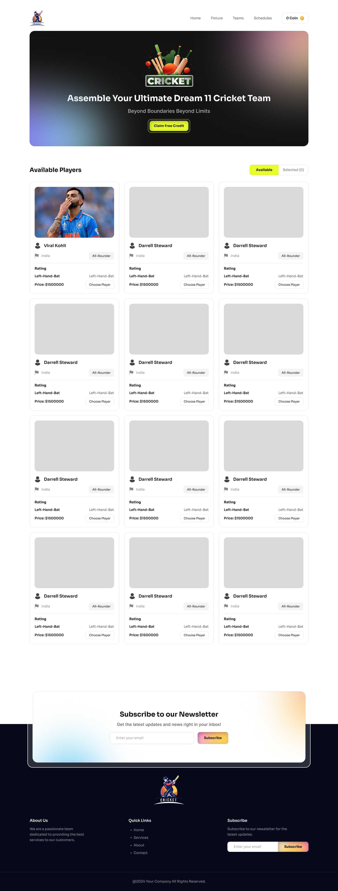

# BPL Dream 11

## Description

BBPL Dream 11 is a React-based static web application that allows users to create and manage their fantasy cricket teams for the Bangladesh Premier League (BPL). Users can participate in various
contests, select their favorite players, and track their team's performance in real-time.

## Features

    -   Frontend: React.js
    -   Backend: N/A
    -   Styling: Tailwind CSS
    -   Database: Local Storage (fake data)

## Technologies Used

    -   React-Toastify
    -   let and const
    -   Arrow function
    -   Template Literals
    -   Destructuring Assignment
    -   Rest and Spread Operators

## Getting Started

1. Clone the repository: git clone https://github.com/programming-hero-web-course1/b10a7-dream-11-DeveloperMonirBD.git
2. Navigate to the project directory: cd bpl-dream-11
3. Install dependencies: npm install
4. Start the development server: npm start

## What to Submit

-   Private Github Repo Link : https://github.com/programming-hero-web-course1/b10a7-dream-11-DeveloperMonirBD

-   Live link to the deployed project :

# React + Vite

This template provides a minimal setup to get React working in Vite with HMR and some ESLint rules.

Currently, two official plugins are available:

-   [@vitejs/plugin-react](https://github.com/vitejs/vite-plugin-react/blob/main/packages/plugin-react/README.md) uses [Babel](https://babeljs.io/) for Fast Refresh
-   [@vitejs/plugin-react-swc](https://github.com/vitejs/vite-plugin-react-swc) uses [SWC](https://swc.rs/) for Fast Refresh

# Designs

## Page with Available Players

## Page with Selected Players

